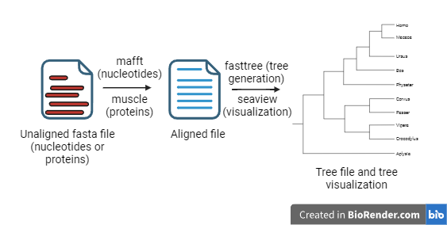

# altrevis

## What is altrevis?
**altrevis (Alignment, Tree and Visualization)** is an easy-to-use, beginner-oriented tool to align DNA/RNA or protein sequences, infer an approximately Maximum Likelihood phylogenetic tree from the alignment and visualize it. 

This scripts is suitable only for Linux-based operating systems.

It provides a straightforward pipeline that only needs the unaligned sequences of interest in a fasta file to get to the visualization of the inferred phylogenetic tree, with near-zero effort on the side of the user. 

altrevis bases its alignment on mafft for nucleotides and on muscle for proteins, two well-established and solid programs that allow low time and resources consumption for not-too-large files (up to 200 sequences); the tree building is performed by fasttree, an easy-to-manage package that is completely user friendly and runs fast and easy: it provides approximative Maximum Likelihood in a quick and processing-efficient way; the tree visualization is based on the well-known program seaview, that allows quick and customisable tree visualization with an intuitive graphic interface.

Here is a visual abstract of the pipeline (Created with [BioRender.com](https://www.biorender.com/)):



## How is altrevis installed?

To install the script, open your terminal, go to your working directory and run:

```bash
git init
git clone https://github.com/AstraBert/altrevis
```

This will add an `altrevis` folder to your working directory: there you will find all the things you can see in the GitHub page. Before getting to work with the actual pipeline script, altrevis.sh, you should run in your terminal:

```bash
sudo
```

This will put you in sudo-mode. with administrator-only permission that will allow you to proceed further in the installation: Linux will now require you to input the password. After having entered this mode, just go and run:

```bash
#This code assumes you remained in the same working directory as before
bash ./altrevis/install_dependencies.sh
```
This script will recognize the Linux distribution you are using and install the needed dependencies with the right method for it. 

Now that you're done, set up an alias to make running altrevis less verbose:

```bash
echo "alias altrevis='bash /absolute/path/to/altrevis/altrevis.sh'" >> ~/.bash_aliases
source ~/.bash_aliases
source ~/.bashrc
```

Make sure to replace `/absolute/path/to/altrevis/altrevis.sh` with the actual absolute path to `altrevis.sh` script

## How does altrevis work?

To get altrevis to work, you just need to provide the path to the unaligned file, where all the sequences are stored, and to specify the alignment type (nucleotides or proteins: if not specified, the default is nucleotide).

```
Usage: altrevis -i,--infile INFILE [-at, --alignment_type nt OR aa]

REQUIRED ARGUMENTS:
  -i, --infile: Provide the path to the original fasta file from which to start the phylogenetic analysis
OPTIONAL ARGUMENTS:
  -at, --alignment_type: Choose between nt (for DNA/RNA alignment) and aa (for protein alignments): default is nt.

Input altrevis -h to show this message again
```
You will get the results stored in a folder named altrevis_results, which will be placed in the base directory of the input unaligned file you provided. This folder will contain the aligned file (with the extension .afn if the input were nucleotides, .afaa if the input were proteins) and the tree file (with the extension .tree): these files will be named as your input one. 

Here's two examples:

1. Aligning nucleotides:
  ```bash
  altrevis -i /media/user/projects/phylo.fasta -at nt
  ```
  The results will be stored in `/media/user/projects/altrevis_results` and will be named `/media/user/projects/altrevis_results/phylo.afn` and `/media/user/projects/altrevis_results/phylo.tree`


2. Aligning proteins:
  ```bash
  altrevis -i /home/linux/phylogenetics/proteins.faa -at aa
  ```
  The results will be stored in `/home/linux/phylogenetics/altrevis_results` and will be named `/home/linux/phylogenetics/proteins.afaa` and `/home/linux/phylogenetics/proteins.tree`

## License and final considerations
The code is protected by the GNU v.3 license. As the license provider reports: "Permissions of this strong copyleft license are conditioned on making available complete source code of licensed works and modifications, which include larger works using a licensed work, under the same license. Copyright and license notices must be preserved. Contributors provide an express grant of patent rights".

Please note that altrevis is still experimental and may contain errors, may fail/take really long while performing large analyses with limited computational power (e.g. on a normal laptop) and may output not-100%-reliable results, so always check them and pull issues whenever you feel it to be the case, we'll be on your back as soon as possible to fix/implement/enhance whatever you suggest!

If you are using altrevis for you project, please consider to cite the author of this code (Astra Bertelli) and this GitHub repository. 


## References
- **mafft**: Katoh K, Standley DM. MAFFT multiple sequence alignment software version 7: improvements in performance and usability. Mol Biol Evol. 2013;30(4):772-780. doi:10.1093/molbev/mst010
- **muscle**: Edgar RC. MUSCLE: multiple sequence alignment with high accuracy and high throughput. Nucleic Acids Res. 2004;32(5):1792-1797. Published 2004 Mar 19. doi:10.1093/nar/gkh340
- **fasttree**: Price MN, Dehal PS, Arkin AP. FastTree 2--approximately maximum-likelihood trees for large alignments. PLoS One. 2010;5(3):e9490. Published 2010 Mar 10. doi:10.1371/journal.pone.0009490
- **seaview**: Gouy M, Tannier E, Comte N, Parsons DP. Seaview Version 5: A Multiplatform Software for Multiple Sequence Alignment, Molecular Phylogenetic Analyses, and Tree Reconciliation. Methods Mol Biol. 2021;2231:241-260. doi:10.1007/978-1-0716-1036-7_15
